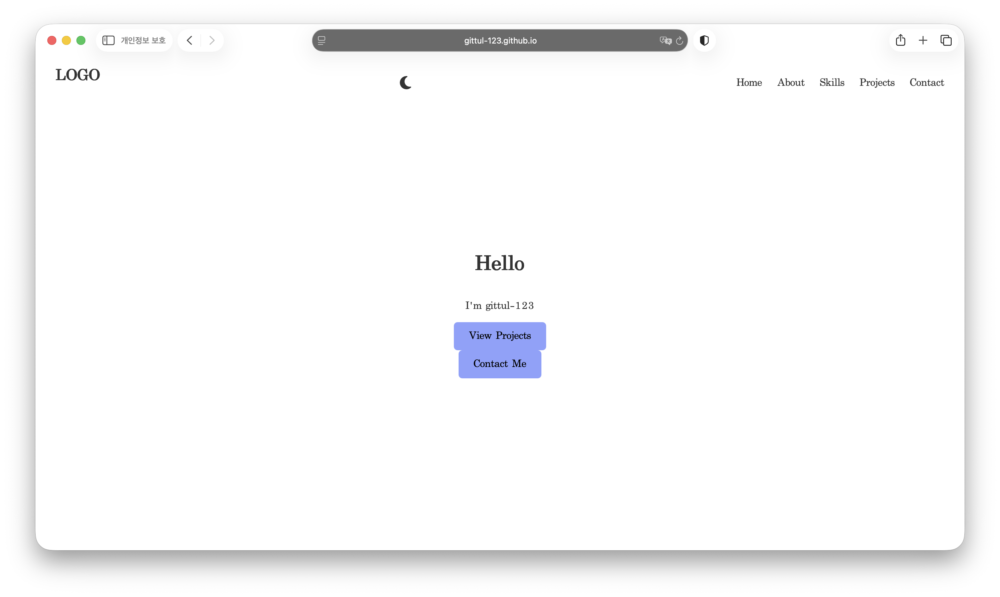
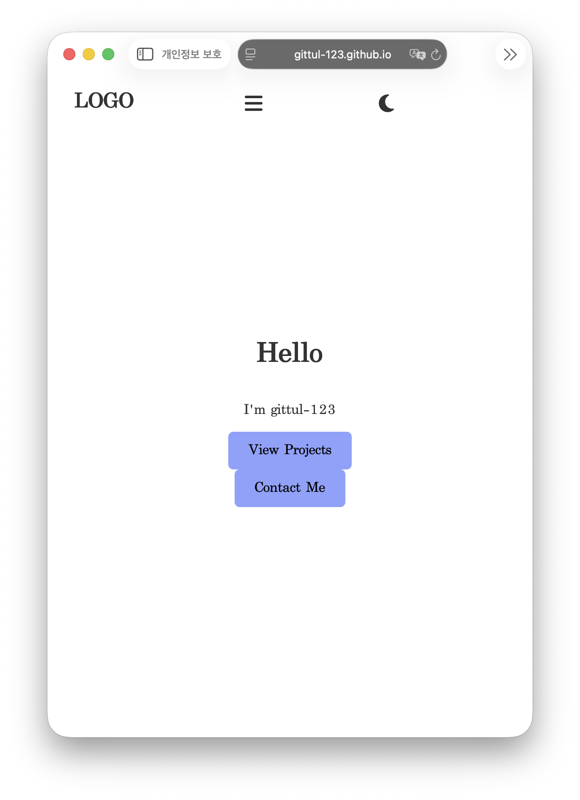
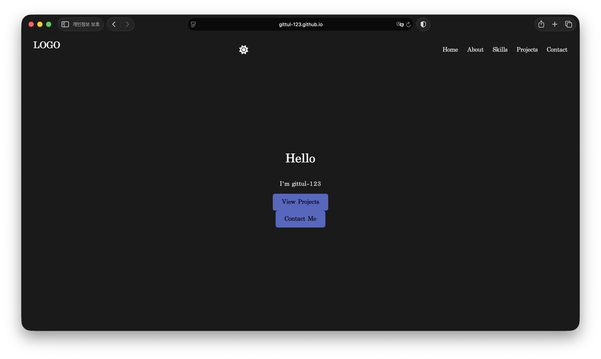

# 포트폴리오 웹페이지

순수 HTML/CSS/JavaScript로 만든 반응형 개인 포트폴리오 웹사이트입니다. GitHub API를 연동해 프로젝트 목록을 자동으로 불러오고, 다크모드와 폼 유효성 검사 등 다양한 인터랙션을 구현했습니다.

## 사용 기술

- HTML5 (시맨틱 마크업)
- CSS3 (Flexbox, Grid, CSS 변수, 반응형 디자인)
- JavaScript (ES6+, DOM 조작, fetch API, Intersection Observer)
- Font Awesome (아이콘)
- GitHub API
- GitHub Pages (배포)

## 배포 URL

[https://gittul-123.github.io/portfolio-website/](https://gittul-123.github.io/portfolio-website/)

## 스크린샷

### 데스크톱

### 모바일

### 다크모드

## 주요 기준값

- 스크롤 탑 버튼: 스크롤 300px 이상에서 표시
- 네비게이션 배경색 변경: 스크롤 60px 이상에서 적용
- 스크롤 애니메이션(Intersection Observer): threshold 0.2 (요소의 20% 이상 보이면 발동)